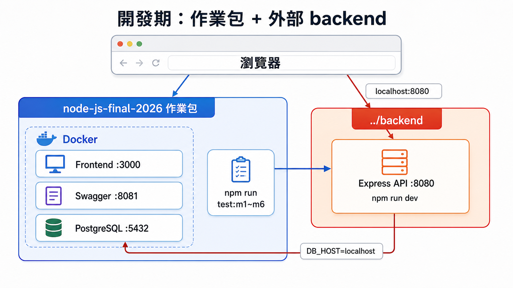
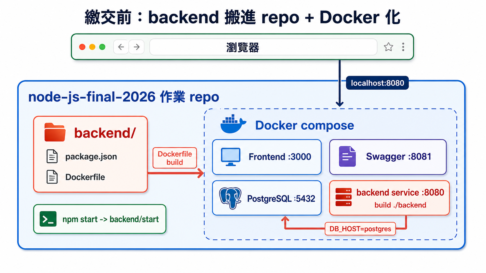

# 最終作業：健身房後端 API — 把這個產品救活


> 你拿到一個**完整的健身房網站前端**（會員、教練、課程、購買方案，全部做好了）
> 和一本**API 規格書**（Swagger）。
> 唯一的問題：它的後端不存在。
>
> **你的任務：把後端蓋出來，讓這個產品活過來。**
> 資料庫怎麼設計、程式怎麼拆、用什麼寫法 — 全部你決定。我們只驗收行為。

---

## 🚀 快速開始

### Step 1：環境準備

1. 安裝 [Docker Desktop](https://www.docker.com/products/docker-desktop/) 並啟動
2. 確認 Node.js >= 20（`node -v`）

### Step 2：一鍵起環境

```bash
docker compose up -d
```

第一次會 build 前端（約 2-5 分鐘），完成後你擁有：

| 網址 | 內容 | 角色 |
|---|---|---|
| http://localhost:3000 | 健身房前端（每一頁都在哭 API 錯誤） | 你的任務地圖 + 最終驗收機 |
| http://localhost:8081 | Swagger API 文件 | 規格書 + Try it out 試打工具 |
| localhost:5432 | PostgreSQL（空的） | 等你的後端來建表 |

**成功長什麼樣**：`docker compose ps` 三個服務都在跑；打開 localhost:3000 看到健身房首頁。

整週開發期的系統環境長這樣：這個 repo 是**作業包**，負責前端、Swagger、PostgreSQL 和測試；你的後端先放在作業包旁邊的 `../backend/`，跑在本機 `localhost:8080`。



### Step 3：建立你的外部後端

```bash
npm install              # 在作業包根目錄先裝驗收測試需要的工具
```

接著開一個**跟本 repo 同層**的後端資料夾：

```bash
cd ..
mkdir backend
cd backend
npm init -y
npm install express cors dotenv pg
npm install -D nodemon
cp ../node-js-final-2026/.env.example .env
```

如果你的作業包資料夾不叫 `node-js-final-2026`，把上面那段路徑換成你的資料夾名稱即可。`.env.example` 裡的資料庫連線資訊已經跟 Docker 裡的 PostgreSQL 對好，開發期 `DB_HOST=localhost`。

開發期的資料夾會長這樣：

```txt
node-js-final-2026/   # 作業包：前端、Swagger、PostgreSQL、測試
backend/              # 你自己寫的後端，跑在 localhost:8080
```

**成功長什麼樣**：在 `backend/` 裡啟動你的 server（例如 `npm run dev`），打開 http://localhost:8081 對 `GET /healthcheck` 按 Try it out → 回 200。

### Step 4：開發迴圈（每支 API 都這樣走）

開發期建議固定開兩個終端機：

- 終端機 A：在外部 `../backend/` 跑 `npm run dev`，讓後端持續聽 `localhost:8080`
- 終端機 B：在本作業包根目錄跑 `npm run test:m1` ~ `npm run test:m6`

1. **Swagger 看規格**（localhost:8081）— request/response 範例都在
2. **在 `../backend/` 寫 code** — 存檔自動重啟（建議用 nodemon）
3. **Try it out 試打** — 需要登入的 API 先按右上角 Authorize 貼上 login 拿到的 token
4. **回作業包跑該里程碑的測試** — `npm run test:m1`（機器裁判，紅了照訊息修；測試會打 `localhost:8080`）
5. **重新整理 localhost:3000** — 看著頁面活過來 🎉

---

## 📜 四條公約（GitHub Actions 驗收的前提）

| # | 公約 | 為什麼 |
|---|---|---|
| ① | 正式繳交時，根目錄 `npm start` 要能啟動 `backend/` 裡的後端，並聽 `PORT` 環境變數指定的 port | CI 用這個指令起你的 server |
| ② | 資料庫連線與 `JWT_SECRET` 一律從環境變數讀（開發期可把本 repo 的 `.env.example` 複製到外部 `backend/.env`） | CI 的資料庫設定跟你本機不同 |
| ③ | 拿到**空的** PostgreSQL，你的後端要能自己把資料表建出來 | CI 每次都給你全新的資料庫 |
| ④ | `GET /healthcheck` 回 200，而且要**等資料庫真的可用之後**才回 200 | CI 靠它判斷你的 server 就緒了沒 |

---

## ⚠️ 地雷總表（先讀，省你好幾個小時）

### 1. 四句逐字訊息合約（最重要）

報名課程（`POST /api/courses/:courseId`）的錯誤訊息被前端拿去**逐字比對**來決定開哪個視窗。
**改一個字、多一個空格，使用者按下報名鈕就會「沒反應」**：

- `已經報名過此課程`
- `已無可使用堂數`
- `已達最大參加人數，無法參加`
- `請先登入`（未登入打需要登入的 API）

### 2. 驗收尺度

- 成功回 `2xx` + `{ "status": "success", "data": ... }`；失敗回 `4xx` + `{ "status": "failed", "message": "..." }`
- 狀態碼**只看 2xx / 4xx**，200 或 201 都算對；錯誤訊息**除了上面四句**，其他文字隨你寫
- 數值欄位（價格等）回數字或數字字串都可以

### 3. 行為語意（直覺容易猜錯的）

- **取消報名是軟刪除**：紀錄還在，只是標記取消時間。所以**取消過的課不能再報名**（會回「已經報名過此課程」）
- **剩餘堂數沒有欄位**：永遠是「買過的總堂數 − 未取消的報名數」即時算出來
- **月營收**（M6 挑戰）：以**報名建立時間**計入月份（不是上課時間）、年份固定當年、單堂均價 = 全部方案總價 ÷ 總堂數、**最後才取整數（floor）** — 詳細公式和數字範例看 Swagger 的 M6 章節

---

## 🏁 里程碑（= GitHub Actions 的 jobs = 你的進度條）

| 里程碑 | 內容 | 本機驗證 | 前端活過來的頁面 |
|---|---|---|---|
| M1 | 種資料：技能 + 方案 CRUD | `npm run test:m1` | 健身方案列表 |
| M2 | 會員：註冊/登入/JWT/個資 | `npm run test:m2` | 註冊、登入、會員中心 |
| M3 | 教練後台：升級教練/開課/改課 | `npm run test:m3` | 教練個人後台、課程管理 |
| M4 | 公開瀏覽:教練列表/詳情/課表 | `npm run test:m4` | 教練列表、教練詳情 |
| M5 | 購買與報名（地雷王） | `npm run test:m5` | 購買方案、報名課程、我的課表 |
| M6 | 月營收統計 ⭐ 挑戰 | `npm run test:m6` | 教練營收報表 |
| 壓軸 | 容器化:你的後端進 Docker | `docker compose up -d --build backend postgres` 後跑 `npm run test:smoke` | — |

**通過標準**：GitHub Actions **七顆 jobs 全數綠燈**（66 條合約測試 + 容器化壓軸），缺一不可。

**壓軸（W10 容器化挑戰）**：本機 M1~M6 都過之後，把外面的 `backend/` 搬進本 repo，變成 `node-js-final-2026/backend/`。只要準備 push / 繳交，就必須先完成這個搬進 repo 的動作。接著幫你的後端寫 Dockerfile、加進 `docker-compose.yml`
（規則寫在 compose 檔的註解裡：服務叫 `backend`、build `./backend`、對外開 8080、要有 healthcheck）。
CI 會用你的 compose 起整包、跑 smoke、然後**重啟你的容器確認資料還在**
（所以資料一定要真的存進 PostgreSQL，放在程式記憶體裡過不了這關）。

本機驗證容器化時，先停掉外部 `../backend/` 的 dev server，避免 8080 被佔住：

```bash
docker compose up -d --build backend postgres
npm run test:smoke
```

容器化完成後的系統環境（對照上面開發期的圖：外部 `backend/` 被搬進本 repo，變成 Docker 裡的 `backend` service，`DB_HOST` 跟著變成 `postgres`）：



---

## 📮 繳交方式

1. 全部做完並確認 `backend/` 已搬進本 repo，再 push 上 GitHub
2. 確認 Actions 的 jobs 狀態（哪幾顆綠 = 你完成了哪些里程碑）
3. 把 README 最上面 badge 連結裡的帳號/repo 改成你自己的
4. **繳交：你的 repo 網址 + 一張前端跑起來的截圖**（任何一頁有真資料的畫面）

> 📏 **考卷規則**：`test/`、`.github/`、根目錄 `package.json` / `package-lock.json` 是驗收包，**不可修改**。
> 評分時會用原版測試抽查重跑，改考卷以 0 分計。（你的後端依賴請裝在 `backend/package.json`；`frontend/` 與 `docs/` 也請不要動。）

---

## ❓ FAQ

**Q1：前端打 API 一直被擋（CORS 錯誤）？**
前端在 3000、你的後端在 8080，瀏覽器會擋跨來源請求。這就是 W3 教過的 `cors` 上場的時刻 — 想想那行 `app.use(cors())` 是幹嘛的。（不管你的後端開發期在外部 `../backend/`，還是最後搬進 Docker，前端和 Swagger 都是從瀏覽器打 `localhost:8080`。）

**Q2：Actions 紅燈了，怎麼讀？**
三步：① 看哪個 step 紅 — 「檢查 backend/」紅 = 忘了把外部後端搬進本 repo；「啟動你的後端」紅 = server 沒起來或 healthcheck 沒回 200，往下看 server.log 的錯誤訊息（通常是環境變數沒讀到）；② 「跑測試」紅 = 點開看哪個測試名稱失敗，測試名稱就是行為描述；③ 回本機 `npm run test:m{N}` 重現它。

**Q3：本機測試紅、但 CI 是綠的（或相反）？**
你本機的資料庫累積了很多測試資料，CI 每次都是全新的。先在作業包跑 `npm run db:reset`（會清空本機資料庫重來）再跑一次。做完壓軸後注意：`db:reset` 會連你搬進 compose 的 backend 容器一起起來佔住 8080；本機開發外部 `../backend/` 時，先 `docker compose stop backend`。

**Q4：測試裡的中文名字是什麼？**
測試名稱描述「行為合約」，紅燈時讀測試名 → 去 Swagger 對應章節看規格 → 用 Try it out 手動重打一次，三步就能定位問題。

**Q5：可以用 TypeORM 嗎？可以不用嗎？**
都可以。資料庫怎麼操作是你的事，驗收只看 HTTP 行為。課堂教過的工具都夠用。

**Q6：`npm install` 之後 test 跑不動？**
測試需要你的 server 先跑著，它是從外面打 HTTP 進來的。開發期請先在外部 `../backend/` 跑 `npm run dev`，再回作業包跑 `npm run test:m1`。正式繳交前，請把 `backend/` 搬進本 repo，並讓 `backend/package.json` 有可用的 `start` script。
